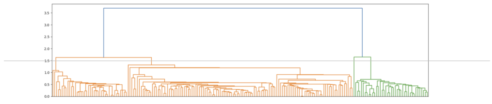

### ADsP - 제45회 - 25.05.17

#### 제1과목 - 데이터 이해

1. 다음 중 빅데이터 정보를 활용하는 방식으로 가장 부적절한 것은 무엇인가?

   - (1) 기존에는 없었던 새로운 방법으로 조합해 사용할 수 있다.
   - (2) 개인정보를 대규모로 공유한다.
   - (3) 분석 방법의 발전으로 기존에는 없었던 가치를 새롭게 부여할 수 있다.
   - (4) 빅데이터 예측을 통해서 아직 발생하지 않은 일에 대한 책임을 무는 것은
바람직하지 않다.
     - [답] 2

2. 빅데이터에 대한 설명으로 적절하지 않은 것은 무엇인가?

   - (1) 빅데이터는 수치형 데이터에 국한되지 않고 영상, 이미지, 문자 등 다양한 형태의 데이터를 망라한다.
   - (2) 빅데이터 분석을 통해서 과거에는 얻기 어려웠던 통찰을 얻을 수 있다.
   - (3) 빅데이터를 활용해서 과거에는 없었던 새로운 서비스를 제공할 수 있다.
   - (4) 빅데이터를 활용해서 개인 맞춤화 서비스를 제공하는 것은 불가능하다.
     - [답] 4

3. DIKW 모델에서 “데이터(Data)”에 대한 설명으로 가장 적절하지 않은 것은 무엇인가?

   - (1) 정보는 가공된 데이터이다.
   - (2) 데이터는 지식과 아이디어가 결합된 창의적인 산물이다.
   - (3) 지식은 정보의 내재화 과정을 통해서 만들어 진다.
   - (4) 데이터는 객관적인 사실에 기반한다.
     - [답] 2

4. 데이터의 일관성과 정확성을 유지하고 검증하는 DBMS 의 특징은 무엇인가?

   - (1) 데이터의 통합성.
   - (2) 데이터의 공용성.
   - (3) 데이터의 무결성.
   - (4) 데이터의 변화성.
     - [답] 3

5. 다음 중 데이터베이스의 특징으로 적절하지 않은 것은 무엇인가?

   - (1) 데이터베이스는 사용자 모두가 동일한 목적을 가지고 데이터를 활용하도록
설계된다.
   - (2) 데이터베이스는 다수의 사용자가 원격으로 접속해 사용할 수 있어야 한다.
   - (3) 데이터베이스의 데이터는 일관성과 영속성을 유지하도록 관리된다.
   - (4) 데이터베이스의 데이터는 권한이 있는 사람이 쉽게 접근해서 변경할 수 있어야 한다.
     - [답] 1

6. 자동차 회사에서 엔지니어링과 에너지의 최적 조합을 찾아내어 연료 효율성을 극대화하는 방법을 연구했다. 그 결과 연료절약형 차량을 설계할 수 있었다. 이때 사용되는 알고리즘은 무엇인가?

   - (1) 회귀 알고리즘.
   - (2) 유전 알고리즘.
   - (3) 연관 규칙 알고리즘.
   - (4) 군집화 알고리즘.
     - [답] 2

7. 개인정보 비식별화 기술에 대한 설명으로 가장 부적절한 것은 어느 것인가?

   - (1) 총계처리: 개별 데이터의 노출을 피하고 총 합과 같은 통계치를 보여준다.
   - (2) 가명처리: 개인정보의 주체가 되는 이름을 가명으로 변경하는 기술이다.
   - (3) 범주화: 정확한 값 대신에 범주 또는 구간으로 대체한다.
   - (4) 마스킹: 개인정보 식별이 가능한 특정 데이터 값을 삭제하는 방법이다.
     - [답] 4

8. 빅데이터 분석 및 활용의 최종 목표로 가장 적절한 것은 무엇인가?

   - (1) 데이터 활용에서의 효율성 제고.
   - (2) 많은 분석을 통해서 다양한 관점의 도출.
   - (3) 이전에는 없었던 새로운 가치의 창출.
   - (4) 많은 사용자들이 공감할 수 있는 분석 결과의 도출.
     - [답] 3

9. 빅데이터 시대의 위기 요인에 대한 해결 방안으로 적절하지 않은 것은 무엇인가?

   - (1) 개인정보 활용에 대한 동의를 강화한다.
   - (2) 개인정보 사용자의 책임을 강화한다.
   - (3) 결과 기반 책임 원칙을 강화한다.
   - (4) 알고리즘에 대한 접근권을 허용한다.
     - [답] 1

10. 다음 중 데이터 활용 사례로 적절하지 않은 것은 무엇인가?

   - (1) 마케팅 캠페인의 전환률을 기반으로 타겟 계층을 최적화 한다.
   - (2) 사용자의 후기를 분석해서 서비스 만족도를 객관적으로 평가한다.
   - (3) 과거 가스 사용량을 바탕으로 앞으로 24 시간 공급을 최적화 한다.
   - (4) 전문가와의 심층 면담으로 절차를 개선한다.
     - [답] 4

#### 제2과목 - 데이터분석 기획

11. 분석 준비도 진단 시 고려 대상이 아닌 것은?

   - (1) 분석 인력과 조직.
   - (2) 분석 비용.
   - (3) 분석 인프라.
   - (4) 분석 문화.
     - [답] 2

12. 분석 과제에서 고려해야 할 5가지 요소 관련된 내용으로 올바른 것은?

   - (1) 활용성 측면에서는 정밀도, 안정성 측면에서는 정확도가 중요하다.
   - (2) 정확도를 높이면 해석이 어려워 질 수 있다.
   - (3) 데이터 분량이 크더라도 로컬에 데이터를 저장하는 것이 중요하다.
   - (4) 처음부터 정형 데이터를 확보에 집중한다.
     - [답] 2

13. 상향식 접근 방법에 대한 설명 중 옳지 않은 것은 무엇인가?

   - (1) Bottom-up 어프로치에 해당한다.
   - (2) 주로 비지도학습 방법으로 데이터를 탐색하는 것에 기반한다.
   - (3) 문제가 명확히 정의되어 있는 경우, 답을 찾는 기법이다.
   - (4) 프로토타이핑 방법도 상향식 접근 방식의 일종이다.
     - [답] 3

14. 전사 차원의 모든 데이터 관리 정책 프로세스 운영 조직 등을 포함하는 표준화된 관리 체계는?

   - (1) 정보전략계획 (ISP).
   - (2) 표준 데이터 생성.
   - (3) 분석 거버넌스.
   - (4) 데이터 거버넌스.
     - [답] 4

15. 분석방법은 알고 있으나 그 대상을 모를 때 적용하는 분석 기획 유형으로 적합한 것은 무엇인가?

   - (1) 최적화 (Optimization).
   - (2) 통찰 (Insight).
   - (3) 솔루션 (Solution).
   - (4) 발견 (Discovery).
     - [답] 2

16. 다음 중 과제 우선순위를 평가할 때 고려하는 기준으로, 본원적 업무와의 직접적인 연관성 및 해당 이슈가 해결되지 않았을 때 발생할 수 있는 위험이나 손실의 정도를 나타내는 것은 무엇인가?

   - (1) 전략적 필요성.
   - (2) 비즈니스 성과와 ROI.
   - (3) 투자의 용이성.
   - (4) 기술적 용이성.
     - [답] 1

17. 데이터 분석 성숙도 모델 4분면에서 기업의 분석 업무 및 분석 기법은 부족하나, 조직 및 인력 등 준비도가 높아 데이터 분석을 바로 시행할 수 있는 기업의 분석 수준 진단 결과는?

   - (1) 도입형.
   - (2) 준비형.
   - (3) 정착형.
   - (4) 확산형.
     - [답] 1

18. 하향식 접근법 분석 과제 도출 단계를 순서대로 나열한 것은?

> - 가. 문제 정의
> - 나. 문제 탐색
> - 다. 해결방안 탐색
> - 라. 타당성 검토

   - (1) 가 나 다 라
   - (2) 나 가 다 라
   - (3) 가 나 라 다
   - (4) 나 가 라 다
     - [답] 2

19. 분석 기획 시 고려사항에 해당하지 않는 것은?

   - (1) 필요한 데이터 확보에 대한 고려가 우선이다.
   - (2) 가치 창출 방법과 유즈케이스를 고려한다.
   - (3) 지속적인 교육 및 활용방안과 관련된 변화 관리가 고려되어야 한다.
   - (4) 최신 분석기법으로 분석해야 한다.
     - [답] 4

20. 아래의 2가지를 설명하는 분석 태스크는 무엇인가?
> - “데이터의 정합성을 검토하고 특성을 파악한다.”
> - “데이터를 시각화하고 요약하여 숨겨진 패턴 관계 이상값 등을 발견한다.”

   - (1) 텍스트 분석.
   - (2) 예측 분석.
   - (3) 탐색적 데이터 분석.
   - (4) 정량적 분석.
     - [답] 3

#### 제2과목 - 데이터분석

21. 다음 해석으로 옳지 않은 것은?

```R
> data("chickwts")
> summary(chickwts)

      weight                 feed
Min.    : 108.0      casein    : 12
1st Qu. : 204.5      horsebean : 10
Median  : 258.0      linseed   : 12
Mean    : 261.3      meatmeal  : 11
3rd Qu. : 323.5      soybean   : 14
Max.    : 423.0      sunflower : 12
```

   - (1) weight의 25%는 “weight의 Q1값” 보다 크다.
   - (2) weight의 IQR은 119이다.
   - (3) 평균이 중앙값보다 크니까 왜도는 양수이다.
   - (4) feed는 명목형 변수이다.
     - [답] 1

22. 상관계수에 대한 설명 중 틀린 것은 무엇인가?

   - (1) 상관계수가 -1일 때, 상관관계가 가장 약하다.
   - (2) 상관계수는 -1과 +1 사이의 실수값이다.
   - (3) 상관계수가 양수이면 두 변수 사이에 양의 선형관계가 있다는 의미이다.
   - (4) 상관계수의 통계적 유의성은 가설 검정을 통해서 확인해야 한다.
     - [답] 1

23. 상관성 분석결과의 해석으로 틀린 것은?

```R
> cor(iris[-5], method="pearson")

             Sepal.Length Sepal.Width Petal.Length Petal.Width
Sepal.Length    1.0000000  -0.1175698    0.8717538   0.8179411
Sepal.Width    -0.1175698   1.0000000   -0.4284401  -0.3661259
Petal.Length    0.8717538  -0.4284401    1.0000000   0.9628654
Petal.Width     0.8179411  -0.3661259    0.9628654   1.0000000
```

   - (1) Sepal.Length와 가장 상관성이 높은 변수는 Petal.Length이다.
   - (2) 가장 상관성이 낮은 경우는 Petal.Length와 Sepal.Width이다.
   - (3) Sepal이 길 수록 너비가 좁아지는 추세가 있다.
   - (4) Petal이 길 수록 너비도 커지는 추세가 있다.
     - [답] 2

24. 다음 회귀분석 결과에 대한 해석으로 옳지 않은 것은 무엇인가?

```R
> res <- lm(formula = Fertility ~ ., data = swiss)
> summary(res)

Call:
lm(formula = Fertility ~ ., data = swiss)

Residuals:
     Min       1Q   Median       3Q      Max
-15.2743  -5.2617   0.5032   4.1198  15.3213

Coefficients:
                  Estimate Std. Error t value Pr(>|t|)
(Intercept)       66.91518   10.70604   6.250 1.91e-07 ***
Agriculture       -0.17211    0.07030  -2.448   0.01873 *
Examination       -0.25801    0.25388  -1.016   0.31546
Education         -0.87094    0.18303  -4.758 2.43e-05 ***
Catholic           0.10412    0.03526   2.953   0.00519 **
Infant.Mortality   1.07705    0.38172   2.822   0.00734 **

---
Signif. codes:  0 ‘***’ 0.001 ‘**’ 0.01 ‘*’ 0.05 ‘.’ 0.1 ‘ ’ 1

Residual standard error: 7.165 on 41 degrees of freedom
Multiple R-squared: 0.7067,   Adjusted R-squared: 0.671
F-statistic: 19.76 on 5 and 41 DF,  p-value: 5.594e-10
```

   - (1) 모델의 설명력은 70.67%이다.
   - (2) Adjusted R-squared의 값은 67.1%이다.
   - (3) Agriculture는 5% 유의수준 하에서 통계적으로 유의하다.
   - (4) Education이 Fertility 변동의 원인이다.
     - [답] 4

25. 모델이 참이라고 예측한 것 중에서 실제로도 참인 것은 무엇인가?

   - (1) 재현률.
   - (2) 민감도.
   - (3) 정밀도.
   - (4) 정확도.
     - [답] 3

26. 다음 중 연속형 변수 간의 유사성 또는 거리를 측정하는 방법으로 적절하지 않은 것은 무엇인가?

   - (1) 마할라노비스 거리.
   - (2) 유클리드 거리.
   - (3) 체비셰프 거리.
   - (4) 자카드 거리.
     - [답] 4

27. ROC 곡선으로 가장 효율적인 도형을 이끌어 냈을 때의 X좌표와 Y좌표의 값은 얼마인가?

   - (1) (0, 1)
   - (2) (1, 0)
   - (3) (1, 1)
   - (4) (0, 0)
     - [답] 1

28. 다음 중 앙상블 기법인 배깅 (Bagging)과 부스팅 (Boosting)에 대한 설명으로 적절한 것은?

   - (1) 부스팅은 잘못 분류된 데이터의 더 큰 가중치를 부여한다.
   - (2) 배깅은 재표본 추출을 사용하지 않는다.
   - (3) 배깅은 항상 단일 모형보다 높은 정확도를 보장한다.
   - (4) 부스팅은 과적합 문제를 방지한다.
     - [답] 1

29. 인공신경망 모형 설명으로 옳지 않은 것은?

   - (1) 은닉층의 개수가 많아진다고 해서 정확도가 항상 보장되지는 않는다.
   - (2) 개개 은닉층의 노드이 개수는 분석가가 집적 설정해 주어야 한다.
   - (3) 설명력 있는 가중치를 선별할 수 있다.
   - (4) 은닉층에서 사용되는 활성화 함수에 따라서 선형, 비선형 모델 구현이 가능하다.
     - [답] 3

30. 로지스틱 회귀분석의 적용 사례로 적절한 것은 무엇인가?

   - (1) 시험 성적 예측.
   - (2) 마케팅의 성공 여부 예측.
   - (3) 정년 예측.
   - (4) 판매량 예측.
     - [답] 2

31. 척도에 대한 내용으로 올바르게 짝지어진 것은 무엇인가?

   - (1) 정수 0~5 중에 선택하는 것은 연속형척도이다.
   - (2) 교통사고의 확률은 순서형 척도이다.
   - (3) 몸무게는 이산형척도이다.
   - (4) 고향이 수도권/비수도권인지는 명목척도이다.
     - [답] 4

32. 범주형 자료 분석에 대한 설명 중 틀린 것은 무엇인가?

   - (1) 적합도 검정은 도수표 내 관찰 도수의 분산과 기대도수 분산이 얼마나 일치하는지를 검정한다.
   - (2) 범주의 특성에 따른 관찰 도수의 비교될 수 있는 기대 도수를 계산해서 사용한다.
   - (3) 동질성 검정은 관측 값들이 정해진 범주 내에서 서로 비슷하게 나타나고 있는지를 검정한다.
   - (4) 독립성 검정은 서로 다른 요인들에 의해 분할되어 있는 경우 그 용인들이 관찰값에 영향을 주는지 여부를 검정한다.
     - [답] 1

33. 기술통계와 관련된 설명 중 틀린 것은 무엇인가?

   - (1) 기술 통계량으로 평균, 중앙값이 있다.
   - (2) 결측치를 모두 0으로 변환하여 계산한다.
   - (3) 기술통계에서는 표본을 가지고 통계량을 계산하게 된다.
   - (4) 이상값은 상자그림 (박스플롯)을 통해서 쉽게 알아볼 수 있다.
     - [답] 2

34. 다음 중 시계열 데이터의 정상성을 확보할 수 있는 방법으로 옳은 것은?

   - (1) 차분 연산 적용.
   - (2) 분산제곱 통계량.
   - (3) 이상치 제거.
   - (4) 결측값 제거.
     - [답] 1

35. 시계열 분해에 대한 설명 중 잘못된 것은 무엇인가?

   - (1) 계절요인: 일정 주기를 가지고 나타나는 규칙적인 변동을 의미한다.
   - (2) 순환요인: 경제나 자연현상으로 설명되는 주기를 가지고 변동을 의미한다.
   - (3) 불규칙요인: 나머지 요인들로 설명되지 않는 나머지 불규칙한 성분이다.
   - (4) 추세요인: 일정 시간동안 편향되어 증가 또는 감소하는 패턴을 의미한다.
     - [답] 2


36. 분석결과에 따른 회귀식으로 올바른 것은?

```R
> data("cars")
> summary(lm(dist ~ speed, cars))

Call:
lm(formula = dist ~ speed, data = cars)

Residuals:
     Min       1Q   Median       3Q      Max
-29.069   -9.525   -2.272    9.215   43.201

Coefficients:
             Estimate Std. Error t value Pr(>|t|)
(Intercept)  -17.5791     6.7584  -2.601   0.0123 *
speed           3.9324     0.4155   9.464 1.49e-12 ***

Signif. codes:  0 ‘***’ 0.001 ‘**’ 0.01 ‘*’ 0.05 ‘.’ 0.1 ‘ ’ 1

Residual standard error: 15.38 on 48 degrees of freedom
Multiple R-squared:  0.6511,    Adjusted R-squared:  0.6438
F-statistic: 89.57 on 1 and 48 DF,  p-value: 1.49e-12
```

   - (1) f(X) = 6.07584 + 0.4155 * X 
   - (2) f(X) = 0.4155 + 6.07584 * X
   - (3) f(X) = -17.5791 + 3.9324 * X
   - (4) f(X) = -17.5791 + 6.7584 * X
     - [답] 3

37. 선형회귀분석의 가정에 대한 설명 중 옳지 않은 것은 무엇인가?

   - (1) 독립성: 독립변수 간에는 서로 관련이 없다. 
   - (2) 선형성: 독립변수의 변화에 따라서 종속변수도 일정한 크기로 변한다.
   - (3) 정규성: 잔차들의 확률분포는 정규분포이다.
   - (4) 등분산성: 잔차의 분산은 모든 관측치에 대해서 일정하다.
     - [답] 1

38. 회귀식을 만들 때 독립변수 후보 모두를 포함한 모형에서 변수를 하나씩 제거하는 변수선택법은 무엇인가?

   - (1) 전진선택법. 
   - (2) 후진제거법.
   - (3) 단계별선택법.
   - (4) 혼합선택법.
     - [답] 2

39. 주성분 분석에 대한 설명으로 틀린 것은 무엇인가?

   - (1) 가중치 산출이 된다. 
   - (2) 변동이 큰 방향을 순서대로 추출할 수 있다.
   - (3) 상관성이 없는 변수를 반들 수 있다.
   - (4) 차원축소의 용도로 활용할 수 있다.
     - [답] 1

40. 주성분분석에 대한 설명으로 틀린 것은 무엇인가?

```R
> res <- prcomp(USArrests, center = T, scale=T)
> summary(res)
Importance of components:
                         PC1      PC2      PC3      PC4
Standard deviation     1.5749  0.9949  0.59713  0.41645
Proportion of Variance 0.6201  0.2474  0.08914  0.04336
Cumulative Proportion  0.6201  0.8675  0.95664  1.00000

> res$rotation
                  PC1        PC2        PC3         PC4
Murder    -0.5358995 -0.4181809  0.3412327   0.64922780
Assault   -0.5831836 -0.1879856  0.2681484  -0.74340748
UrbanPop  -0.2781909  0.8728062  0.3780158   0.13387773
Rape      -0.5434321  0.1673186 -0.8177779   0.08902432
```

   - (1) 성분 2개로 4개 변수를 86% 이상 설명할 수 있다. 
   - (2) PC2에 가장 크게 기여하는 변수는 UrbanPop이다.
   - (3) PC3에 가장 크게 기여하는 변수는 Rape이다.
   - (4) 전반적으로 Murder의 영향력이 가장 크다.
     - [답] 4

41. 의사결정나무에 대한 설명으로 옳지 않은 것은 무엇인가?

   - (1) 종속변수가 연속형일 때 가지 분할을 위해 분산을 활용할 수 있다.
   - (2) 종속변수가 범주형일 때 가지 분할을 위해 엔트로피를 활용할 수 있다.
   - (3) 가지치기(pruning)를 통해 학습 데이터 세트에서의 정확도를 높일 수 있다.
   - (4) 최종 노드가 많을수록 과대적합 발생 가능성이 증가한다.
     - [답] 3

42. k-means에 대한 설명 중 틀린 것은?

   - (1) k를 임의로 설정할 수 있다. 
   - (2) 이상치에 민감하다.
   - (3) 중심점을 기준으로 군집이 만들어 진다.
   - (4) 군집 개수를 알고리즘이 자동으로 선택해준다.
     - [답] 4

43. SOM에 대한 설명 중 틀린 것은 무엇인가?

   - (1) 입력층과 경쟁층은 부분적으로 연결된다 (locally connected). 
   - (2) 고차원 데이터를 저차원에서 나타내는 방법이다.
   - (3) 반복해서 경쟁한다.
   - (4) 순전파 (전방 패스) 만을 사용한다.
     - [답] 1

44. 다음 덴드로그램에서 Height=1.5일 때, 몇 개의 클러스터가 만들어 지는가?



   - (1) 2개. 
   - (2) 3개.
   - (3) 4개.
   - (4) 5개.
     - [답] 3

45. 버터를 구매했을 때와 버터와 빵을 함께 구매했을 때의 상관관계에 대해 해당하는 것은 무엇인가? 다음 표는 구매 이력을 보여준다.

| 내용 | 횟수 |
| :---: | :--- |
| 빵, 버터 | 3 |
| 빵 | 1 |
| 치즈 | 1 |

   - (1) 향상도: 0.25
   - (2) 향상도: 1.25
   - (3) 신뢰도: 0.6
   - (4) 신뢰도: 0.75
     - [답] 2

46. 연관분석 A → B일 경우, 지지도에 해당하는 설명은?

   - (1) 거래 중에서 A를 구매할 확률이다.
   - (2) 거래 중에서 B를 구매할 확률이다.
   - (3) 거래 중에서 A를 구매하고 이어서 B를 구매할 확률이다.
   - (4) 전체 거래 중에서 A와 B를 동시에 구매할 확률이다.
     - [답] 4

47. 군집분석에 대한 설명 중 옳지 않은 것은?

   - (1) 종속변수가 필요 없는 분석이다.
   - (2) 관측치 사이의 거리 계산방법을 정해주어야 한다.
   - (3) 입력변수가 범주형일 경우 군집분석을 할 수 없다.
   - (4) 만들어진 군집에 대한 해석은 분석가의 몫이다.
     - [답] 3

48. 다차원 척도법에 대한 설명으로 부적절한 것은?

   - (1) 고차원 데이터를 저차원으로 표현해 준다.
   - (2) 관측치 사이의 유사성으로 뭉쳐지기 때문에 군집화 효과를 얻을 수 있다.
   - (3) 데이터의 절대적 위치를 알 수 있다.
   - (4) 계량적 방법과 비계량적 방법이 있다.
     - [답] 3

49. 계통추출 정의에 대한 설명으로 가장 적절한 것은?

   - (1) 모집단의 데이터에 일련번호를 부여하고 일정한 거리를 두고 추출하는 방법
이다.
   - (2) 모집단의 개개 값을 동일 확률로 추출하는 방법이다.
   - (3) 데이터 값들을 중첩 없는 계층으로 분할해 추출한다.
   - (4) 다단계 표본 추출 방법이다.
     - [답] 1